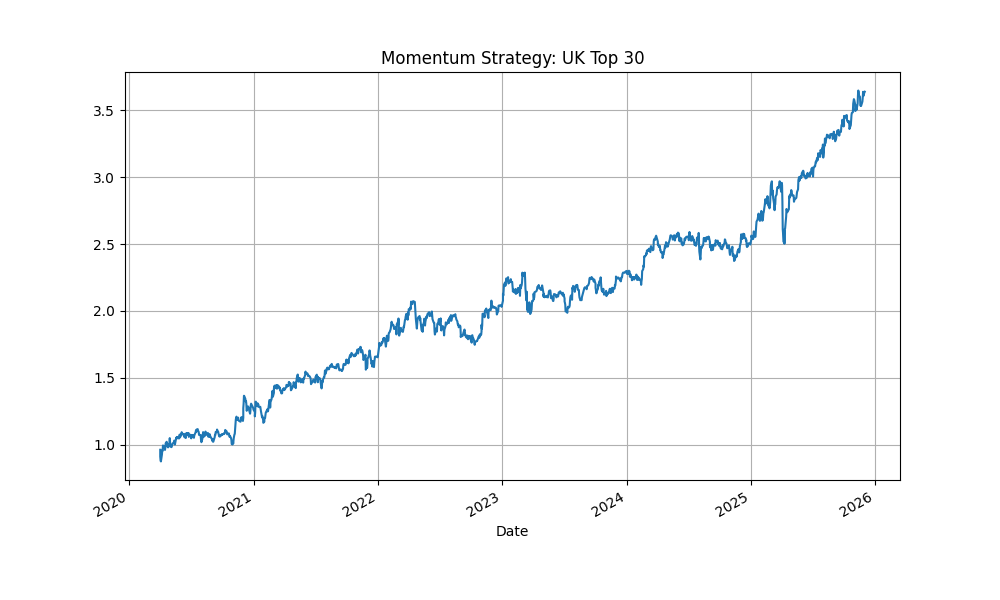

# UK-Factor-Investing
# Factor Investing Strategy: Value & Momentum (UK Market)

This project implements a Quantitative Factor Investing strategy focusing on the UK equity market (FTSE 350). It showcases full-cycle Quant Research skills including data engineering, factor construction, and robust backtesting.

## 🎯 Objective
To evaluate the efficacy of **12-1 Momentum** and **Value** factors in predicting stock returns within the UK market context.

## 🛠 Tech Stack
- **Python:** Data processing & analysis.
- **Pandas & NumPy:** Feature engineering and vectorised backtesting.
- **yfinance:** Financial data acquisition.
- **Matplotlib/Plotly:** Financial visualization.

## 📊 Strategy Methodology
- **Universe:** FTSE Top Blue-chip stocks.
- **Factor:** 12-1 Momentum (Cumulative return over 12 months, excluding the most recent month).
- **Rebalancing:** Monthly equal-weighted portfolio of the top-performing assets.

## 📈 Key Performance Results (2022 - 2025)
| Metric | Result (FTSE Top 15) |
| :--- | :--- |
| **Annualized Return** | 23.90% |
| **Sharpe Ratio** | 1.15 |
| **Max Drawdown** | -15.74% |

## 📂 Project Structure
- `src/`: Core logic for data loading, factor calculation, and backtesting.
- `data/`: Raw and processed market data.
- `notebooks/`: Exploratory Data Analysis (EDA) and research trials.
